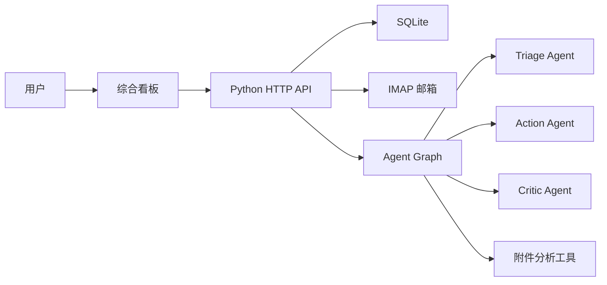

# 架构设计说明

```mermaid
flowchart LR
  U["用户"] --> UI["综合看板"]
  UI --> API["Python HTTP API"]
  API --> DB["SQLite"]
  API --> IMAP["IMAP 邮箱"]
  API --> G["Agent Graph"]
  G --> T["Triage Agent"]
  G --> A["Action Agent"]
  G --> C["Critic Agent"]
  G --> F["附件分析工具"]
```

## 工作流

邮件输入 -> Triage 分类 -> 附件分析 -> Action 生成 Todo/草稿 -> Critic 审查 -> 保存结果 -> 用户确认。

