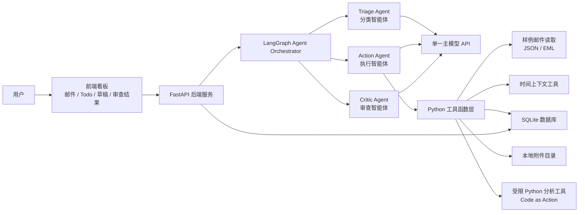
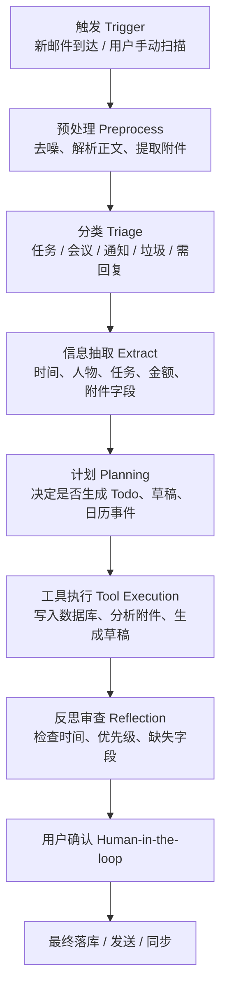
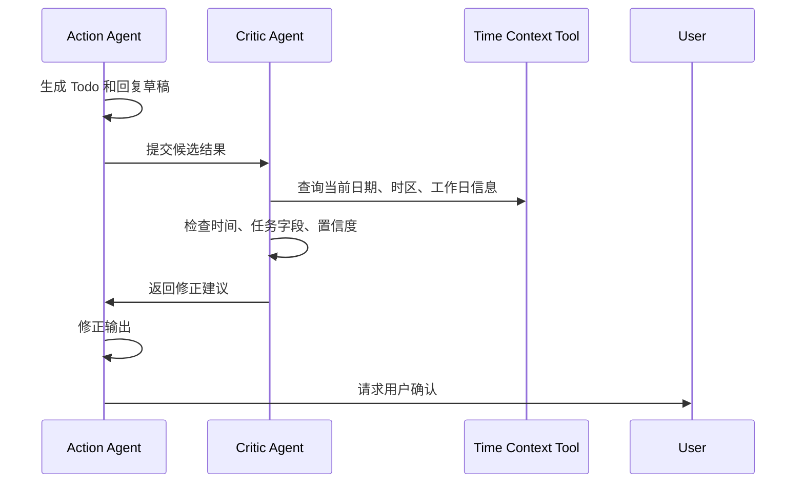
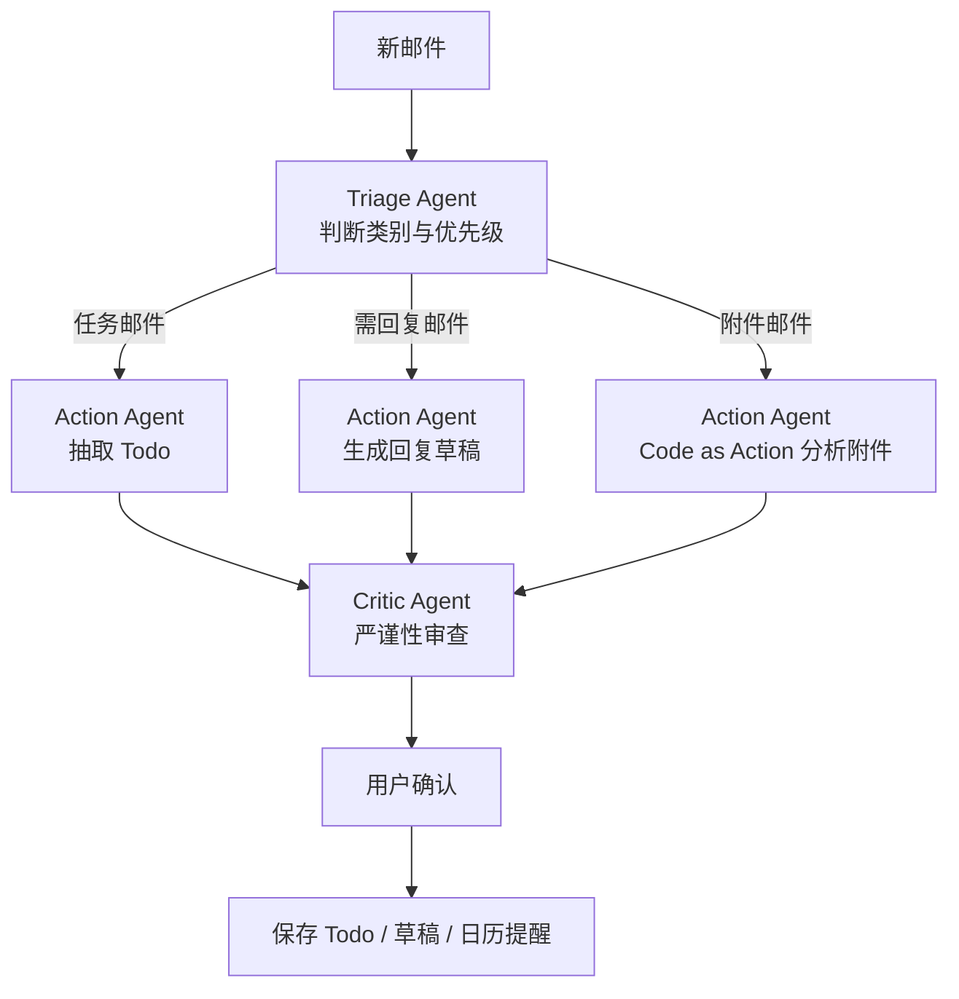

# 智能邮箱助理与自动化待办生成 Agent

## 项目开题报告 / 敏捷架构规划书

---

## 0. 准备阶段：项目定位与客户假设

**项目名称**：智能邮箱助理与自动化待办生成 Agent

**项目类型**：基于大语言模型智能体的敏捷软件工程实践项目

**目标用户**：

- 现代职场人
- 项目经理
- 销售、客服、行政人员
- 教师、科研人员
- 需要长期处理大量邮件的知识工作者

**核心场景**：

用户每天收到大量邮件，其中包含会议安排、任务分配、截止日期、审批请求、附件表格和需要回复的信息。传统邮箱主要解决“收发邮件”的问题，但无法主动帮助用户识别任务、生成待办、处理附件和起草回复。

本项目希望构建一个基于 **LLM Agent 架构** 的智能邮箱助理，使其能够：

- 自动读取和整理邮箱信息。
- 对邮件进行智能分类。
- 从邮件正文和附件中抽取任务、时间、负责人、优先级等信息。
- 自动生成结构化 Todo。
- 为用户智能编写回复草稿。
- 处理 Excel、CSV 等表格附件。
- 对关键结果进行反思和审查。
- 在高风险操作前保留人工确认，保证人机协同安全。

---

# 一、提出问题：为什么要做这个项目？

## 1.1 现实痛点

现代职场中，邮件仍然是最重要的正式沟通工具之一。然而，传统邮箱系统更像是一个“信息堆积箱”，而不是一个“行动管理中心”。用户在处理邮件时经常遇到以下问题：

| 痛点 | 表现 | 后果 |
|---|---|---|
| 邮件冗余 | 通知、抄送、系统消息、广告和真正重要的任务邮件混杂在一起 | 用户难以快速判断哪些邮件需要立即处理 |
| 待办流失 | 任务隐藏在长邮件、转发线程或附件表格中 | 容易错过截止时间，遗漏关键工作 |
| 回复成本高 | 用户需要理解上下文、组织语言、确认细节 | 大量碎片时间被消耗在低价值重复劳动中 |
| 附件处理繁琐 | 表格中包含名单、金额、任务、日期、进度等信息 | 需要人工下载、筛选、复制和整理 |
| 时间表达模糊 | 邮件中常出现“明天下班前”“下周三前”“本月底”等表达 | 系统和用户都容易产生理解偏差 |
| 信息分散 | 邮件、日历、Todo、项目管理工具之间割裂 | 工作流不连续，任务追踪困难 |

## 1.2 项目问题陈述

当前邮箱系统主要解决“信息传递”，但没有真正解决“行动生成”。大量重要工作并不是以结构化任务的形式出现，而是隐藏在自然语言邮件和附件中。

本项目要解决的核心问题是：

> 如何让 AI Agent 从邮件中理解用户真正需要采取的行动，并将邮箱信息自动转化为可执行、可追踪、可确认的结构化待办事项？

## 1.3 项目目标

本项目希望完成从“邮件信息”到“行动任务”的自动化转化闭环：

```text
邮件输入
  -> 邮件分类
  -> 信息抽取
  -> Todo 生成
  -> 草稿生成
  -> 附件分析
  -> 反思审查
  -> 用户确认
  -> 最终执行
```

---

# 二、电梯演讲：Elevator Pitch

我们的产品是一个面向职场人的智能邮箱助理。它不仅能帮你分类邮件，还能自动识别邮件中的任务、截止日期、负责人和附件信息，并生成结构化待办事项。对于需要回复的邮件，它会自动起草专业回复；对于包含表格附件的邮件，它能调用代码分析数据并提取关键任务。用户只需要确认关键动作，而不必从头阅读、整理和记录。它把邮箱从“信息堆积箱”变成“自动行动中心”。

---

# 三、设计产品包装：核心卖点与杀手级功能

## 3.1 产品定位

**一句话定位**：

> 一个能够阅读邮件、理解任务、生成 Todo、辅助回复和处理附件的企业级 AI 邮箱 Agent。

## 3.2 核心卖点

| 核心卖点 | 描述 |
|---|---|
| 邮件自动分流 | 自动识别重要邮件、通知邮件、会议邮件、任务邮件、垃圾邮件和需要回复的邮件 |
| Todo 自动生成 | 从邮件正文和附件中抽取任务、截止时间、优先级、负责人和来源证据 |
| 回复草稿生成 | 根据邮件上下文生成符合语气、场景和业务目标的回复草稿 |
| 表格附件分析 | 通过 Code as Action 编写并执行 Python 代码读取 Excel、CSV 等附件 |
| 多智能体审查 | 通过 Critic Agent 检查时间、任务完整性、优先级和潜在风险 |
| 人机协同安全 | 系统只提供建议和草稿，重要动作必须由用户确认 |

## 3.3 Killer Feature 1：邮件到 Todo 的一键转化

系统能够从邮件中自动生成结构化任务。例如：

```json
{
  "title": "提交项目开题报告",
  "source_email": "课程助教邮件",
  "deadline": "2026-06-05 23:59",
  "priority": "high",
  "assignee": "当前用户",
  "evidence": "邮件中提到：请于本周五前提交开题报告",
  "status": "pending_confirmation"
}
```

## 3.4 Killer Feature 2：模糊时间智能纠错

邮件中可能出现如下表达：

> 请明天下午前发我最终版。

Agent 不会草率地直接写入日历或 Todo，而是结合：

- 当前日期
- 用户时区
- 邮件发送时间
- 邮件线程上下文
- 工作日和节假日规则
- Critic Agent 审查结果

输出类似结果：

```json
{
  "original_time_expression": "明天下午前",
  "parsed_deadline": "2026-06-03 18:00",
  "confidence": 0.82,
  "need_user_confirmation": true
}
```

## 3.5 Killer Feature 3：Code as Action 处理表格附件

当邮件包含 Excel 或 CSV 附件时，Action Agent 可以生成并执行 Python 代码：

```python
import pandas as pd

df = pd.read_excel("project_tasks.xlsx")
urgent_tasks = df[df["deadline"] <= "2026-06-05"]
print(urgent_tasks[["task", "owner", "deadline"]])
```

系统据此生成任务摘要和 Todo，而不是只依赖大模型对附件内容进行模糊猜测。

---

# 四、否定清单：Not-List

为了控制项目边界，避免功能膨胀，本项目明确不做以下内容：

| 坚决不做 | 原因 |
|---|---|
| 不做即时通讯工具 | 本项目聚焦邮箱，不替代微信、Slack、Teams、飞书等 IM 工具 |
| 不自动发送最终邮件 | 回复草稿必须由用户确认后发送，保证安全性 |
| 不绕过邮箱权限机制 | 必须通过 OAuth、IMAP/SMTP 或官方 API 授权访问 |
| 不做完整 OA 系统 | 不覆盖审批、人事、财务、合同流转等大型企业管理功能 |
| 不保存完整敏感邮件明文作为训练数据 | 避免隐私泄露和合规风险 |
| 不承诺 100% 自动理解所有邮件 | 对低置信度结果必须要求用户确认 |
| 不在 MVP 阶段做复杂多语言支持 | 优先支持中文和英文邮件的基础处理 |
| 不做无限深度附件分析 | MVP 阶段重点支持 Excel、CSV 和基础 PDF 文本提取 |
| 不替代用户的最终业务判断 | Agent 提供建议，最终决策仍由用户完成 |

---

# 五、结识邻居：外部依赖与系统边界

## 5.1 邻居清单

| 邻居系统 | MVP 阶段处理方式 | 后续扩展方式 |
|---|---|---|
| 邮件数据源 | 使用本地邮件样例、JSON、EML 或手动导入的测试邮件 | Gmail API、Microsoft Graph API、IMAP/SMTP |
| 日历系统 | 只生成日历提醒建议，不直接同步 | Google Calendar API、Outlook Calendar API |
| Todo / 项目管理系统 | 使用系统内置 Todo 看板 | Notion、Trello、Jira、飞书任务等 API |
| 大模型供应商 | 接入一个主模型 API，用于分类、抽取、草稿和审查 | 通过 aisuite 支持多模型切换 |
| 工具连接层 | 用普通 Python 工具函数模拟邮件、附件、数据库工具 | 使用 MCP 标准化邮箱、日历、数据库和文件工具 |
| 数据存储 | 使用 SQLite 保存邮件索引、Todo、草稿和审查记录 | 升级为 MySQL / PostgreSQL |
| 缓存 | 使用 Python 内存缓存或 SQLite 中间表 | 高并发场景引入 Redis |
| 附件存储 | 使用本地临时目录保存 Excel、CSV、PDF 等附件 | 升级为 MinIO、S3、OSS 等对象存储 |
| 身份认证 | 课程演示阶段可免登录或使用简单用户标识 | OAuth2、JWT、企业 SSO |

## 5.2 系统边界

MVP 阶段不直接连接真实用户邮箱，而是通过本地样例邮件完成核心流程演示。

后续生产版本不直接“拥有”用户邮箱，而是通过用户授权访问邮箱数据。

系统不替代用户判断，而是提供分类建议、Todo 候选项、回复草稿和附件分析结果。

系统可以辅助创建 Todo、草稿和日历提醒，但高风险动作必须经过用户确认。

---

# 六、展示解决方案：技术栈规划

## 6.1 推荐技术栈

| 层次 | MVP 技术选型 | 说明 |
|---|---|---|
| 前端 | Vue 3 + Vite | 固定一个前端方向，构建邮件、Todo、草稿和审查结果的综合看板 |
| UI 组件 | Element Plus | 与 Vue 生态匹配，适合快速构建课程演示界面 |
| 后端 | Python FastAPI | 更适合 AI Agent、LLM、数据分析集成 |
| Agent 编排 | LangGraph | 将 Triage、Action、Critic 设计为可控的工作流节点 |
| LLM 接入 | 单一主模型 API | MVP 阶段先保证稳定调用，不引入多模型切换复杂度 |
| 数据库 | SQLite | 轻量持久化邮件索引、Todo、草稿和审查日志 |
| 缓存 | Python 内存缓存 / SQLite 中间表 | MVP 不引入 Redis |
| 附件处理 | pandas、openpyxl、pdfplumber | 处理 Excel、CSV 和基础 PDF 文本 |
| 工具层 | Python 工具函数 | 用函数模拟邮件读取、Todo 写入、附件分析和时间上下文 |
| 邮件输入 | 本地 JSON / EML / 样例文件 | 避免真实邮箱 OAuth 接入拖慢 MVP |
| 部署 | 本地运行，Docker 可选 | 课程展示优先保证可运行和可解释 |

## 6.2 后续扩展技术栈

| 扩展方向 | 可引入技术 | 引入时机 |
|---|---|---|
| 真实邮箱接入 | Gmail API、Microsoft Graph API、IMAP/SMTP | MVP 跑通后 |
| 标准化工具连接 | MCP | 需要接入多个外部系统时 |
| 高并发缓存 | Redis | 多用户、高频邮件处理时 |
| 生产级数据库 | MySQL / PostgreSQL | 多用户部署和权限管理时 |
| 多模型切换 | aisuite | 需要比较成本、速度和质量时 |
| 对象存储 | MinIO / S3 / OSS | 附件数量较多或需要云端部署时 |
| 生产部署 | Docker + Nginx + 云服务器 | 课程演示后进入长期维护时 |

## 6.3 MVP 总体架构图



---

# 七、Andrew Ng Agentic AI 设计模式融合

## 7.1 任务分解：Task Decomposition

邮件处理不是一次性调用大模型完成，而是拆解为多阶段工作流：



### 关键分解步骤

| 阶段 | 输入 | 输出 |
|---|---|---|
| 触发 | 新邮件事件、用户手动点击 | 邮件处理任务 |
| 预处理 | 邮件正文、标题、发件人、附件 | 标准化邮件对象 |
| 分类 | 标准化邮件对象 | 邮件类别、优先级 |
| 抽取 | 邮件内容 | Todo 候选项、时间、负责人 |
| 规划 | 抽取结果 | 动作计划 |
| 执行 | 动作计划 | Todo、草稿、附件分析结果 |
| 反思 | 执行结果 | 修正建议、风险提示 |
| 确认 | 审查后的结果 | 用户最终决策 |

## 7.2 工具使用：Tool Use

Agent 通过工具与外部世界交互，而不是只停留在文本生成。

### 工具能力设计

| 工具 | 能力 |
|---|---|
| Email Sample Reader Tool | 读取本地 JSON、EML 或课程演示邮件样例 |
| Draft Tool | 生成回复草稿并保存到 SQLite，不自动发送 |
| Calendar Suggestion Tool | 生成日历提醒建议，不直接写入第三方日历 |
| Todo Tool | 创建、修改、完成待办 |
| SQLite Database Tool | 写入邮件索引、任务记录、草稿和审查日志 |
| Attachment Tool | 解析 Excel、CSV、PDF、Word |
| Python Analysis Tool | 执行受限 Python 代码分析 Excel、CSV 等附件 |
| Time Context Tool | 获取当前时间、用户时区、节假日信息 |

### MVP 工具连接方式

MVP 阶段优先采用普通 Python 工具函数实现工具调用，降低工程复杂度：

```text
Agent
  -> read_email_samples()
  -> parse_attachment()
  -> save_todo_to_sqlite()
  -> save_draft_to_sqlite()
  -> get_time_context()
  -> run_limited_python_analysis()
```

这种方式的优势是：

- 实现成本低，适合课程 MVP。
- 方便调试和展示工具调用过程。
- 能完整体现 Tool Use 的设计模式。
- 后续可以平滑封装为 MCP Server。

### MCP 后续扩展设计

本项目仍在架构规划中保留 **MCP，Model Context Protocol**，作为后续标准化工具连接方案：

```text
Agent
  -> MCP Email Server
  -> MCP Calendar Server
  -> MCP Database Server
  -> MCP File Server
  -> MCP Python Sandbox Server
```

后续引入 MCP 的价值包括：

- 工具接口标准化，便于替换 Gmail、Outlook、Exchange。
- Agent 不直接耦合具体 API。
- 可为每个工具设置权限边界。
- 方便记录工具调用日志，便于审计。
- 支持扩展到企业内部系统。

## 7.3 反思机制：Reflection

邮件任务生成存在高风险点，例如时间解析错误、任务遗漏、错误理解邮件语气、错误处理附件。因此系统设计 **执行智能体 + 审查智能体** 的反思机制。

### 反思流程



### Critic Agent 审查内容

| 审查项 | 示例 |
|---|---|
| 时间一致性 | “明天”是否基于邮件发送时间还是当前时间 |
| 任务完整性 | 是否缺少负责人、截止日期、行动项 |
| 优先级合理性 | 是否误把普通通知识别为紧急任务 |
| 证据可追溯 | Todo 是否能回溯到邮件原文依据 |
| 回复语气 | 是否符合正式、简洁、礼貌要求 |
| 附件结果 | 表格字段是否识别正确 |
| 安全边界 | 是否涉及自动发送、敏感数据外泄 |

### 反思输出示例

```json
{
  "issue": "deadline_ambiguous",
  "original": "下周三前提交",
  "suggested_deadline": "2026-06-10 18:00",
  "confidence": 0.76,
  "critic_comment": "建议用户确认，因为邮件发送时间和当前处理时间跨周。"
}
```

## 7.4 多智能体协作：Multi-Agent Collaboration

本项目采用三类核心 Agent 协作：

| Agent | 中文名称 | 职责 |
|---|---|---|
| Triage Agent | 分类智能体 | 邮件分类、优先级判断、是否需要行动 |
| Action Agent | 执行智能体 | 执行任务抽取、草稿生成、附件分析、调用工具 |
| Critic Agent | 严谨性审查智能体 | 审查时间、任务完整性、安全性和输出质量 |

### 多智能体协作流程



### Code as Action 模式

对于表格附件，Agent 不仅“读附件摘要”，而是生成并执行代码：

1. 判断附件类型。
2. 生成 Python 分析代码。
3. 在沙箱环境执行。
4. 读取输出结果。
5. 生成结构化 Todo。
6. Critic Agent 检查字段和结果是否可信。

适用场景：

- 项目任务表。
- 会议报名表。
- 费用报销表。
- 客户需求列表。
- 周报或月报数据表。
- 截止日期清单。

---

# 八、功能模块规划

## 8.1 后端模块

| 模块 | 功能 |
|---|---|
| 邮件样例导入模块 | 导入本地 JSON、EML 或课程演示邮件样例 |
| 邮件预处理模块 | 清洗正文、提取标题、发件人、时间和附件路径 |
| Agent 编排模块 | 使用 LangGraph 管理 Triage、Action、Critic 三个节点 |
| 工具函数模块 | 封装邮件读取、SQLite 写入、附件分析和时间上下文工具 |
| Todo 生成模块 | 从邮件内容中生成结构化 Todo |
| 草稿生成模块 | 生成可编辑回复草稿，不自动发送 |
| 附件分析模块 | 使用 pandas、openpyxl 处理 Excel、CSV，PDF 作为可选 |
| 审查模块 | 对时间、任务、草稿进行反思与纠错 |
| SQLite 持久化模块 | 保存邮件索引、Todo、草稿和审查日志 |

## 8.2 前端模块

| 页面 / 区域 | 功能 |
|---|---|
| 综合看板 | 在一个页面集中展示邮件列表、Todo、草稿和审查结果 |
| 邮件列表区域 | 显示邮件分类、优先级、处理状态 |
| Todo 区域 | 显示待确认、已确认、已完成的任务 |
| 草稿区域 | 用户查看、修改、确认回复草稿 |
| 附件分析区域 | 显示表格摘要、字段提取、生成任务 |
| 审查提示区域 | 显示 Critic Agent 的风险提示和置信度 |

MVP 阶段不拆分过多独立页面，采用一个综合看板降低前端开发成本，并更利于课堂演示完整流程。

---

# 九、关注那些使我们夜不能寐的问题：风险清单

| 风险 | 影响 | 应对策略 |
|---|---|---|
| 邮件隐私泄露 | 高 | MVP 使用样例数据；生产版本采用 OAuth 授权、最小权限、敏感字段脱敏和本地缓存加密 |
| LLM 误解任务 | 高 | 引入 Critic Agent、证据回溯、用户确认 |
| 模糊时间解析错误 | 高 | 使用 Time Context Tool，低置信度强制确认 |
| 自动发送风险 | 高 | 默认只生成草稿，不自动发送 |
| Token 成本过高 | 中高 | 邮件摘要缓存、分块处理、小模型预分类、大模型精处理 |
| 长邮件上下文丢失 | 中 | 邮件分段摘要、RAG 检索、线程级摘要 |
| 附件格式复杂 | 中 | MVP 优先支持 Excel、CSV、PDF 文本，复杂格式后续扩展 |
| 模型供应商不稳定 | 中 | MVP 固定一个稳定模型，后续再用 aisuite 做多模型切换 |
| 工具调用失败 | 中 | 重试机制、失败回滚、任务状态记录 |
| 企业合规要求 | 高 | MVP 使用样例数据，后续生产版本再补充审计日志、权限管理和数据合规方案 |
| Prompt 注入攻击 | 高 | 工具权限隔离、系统提示约束、邮件正文与指令隔离 |
| 附件恶意内容 | 高 | 文件扫描、沙箱执行、禁止执行附件中的宏或脚本 |

---

# 十、估算项目规模：故事点估算

采用敏捷故事点估算，参考斐波那契数列：1、2、3、5、8、13。

## 10.1 MVP 规模估算

| MVP 模块 | 用户故事 | 故事点 |
|---|---|---:|
| 邮件样例导入 | 用户可以导入 JSON、EML 或课程样例邮件 | 3 |
| 邮件预处理 | 系统可以读取正文、标题、发件人、附件路径 | 5 |
| 邮件分类 Agent | 系统可以自动分类邮件 | 5 |
| Todo 抽取 Agent | 系统可以从邮件生成结构化 Todo | 8 |
| 回复草稿生成 | 系统可以生成可编辑回复草稿 | 5 |
| Excel / CSV 附件分析 | 系统可以解析表格并提取任务 | 8 |
| Critic 审查机制 | 系统可以检查时间、任务和风险 | 8 |
| SQLite 持久化 | 系统可以保存邮件、Todo、草稿和审查结果 | 3 |
| 前端综合看板 | 用户可以查看、确认、编辑 Todo 和草稿 | 8 |
| 测试与演示 | 准备样例数据、演示脚本和基础测试 | 5 |

**MVP 总故事点**：58 点

## 10.2 规模判断

58 点更符合课程期末项目的交付节奏。该规模能够完整展示“邮件输入 -> Agent 分类 -> Todo / 草稿 / 附件分析 -> Critic 审查 -> 用户确认”的核心闭环，同时避免真实邮箱 OAuth、Redis、MySQL、MCP 全量实现、多模型切换等非核心复杂度。

## 10.3 后续扩展规模估算

| 扩展模块 | 故事点 |
|---|---:|
| Gmail / Outlook 真实邮箱授权 | 13 |
| MCP 工具封装 | 8 |
| MySQL / PostgreSQL 迁移 | 5 |
| Redis 缓存 | 3 |
| aisuite 多模型切换 | 5 |
| 日历 API 同步 | 8 |
| 多用户登录与权限管理 | 8 |
| Docker + Nginx 云部署 | 5 |

这些扩展模块不纳入 MVP，但可作为后续 Sprint 的产品演进路线。

---

# 十一、明晰要舍弃什么：可调节范围与 Trade-offs

## 11.1 MVP 必须保留

| 功能 | 原因 |
|---|---|
| 邮件读取或样例导入 | 项目基础能力 |
| 邮件分类 | 展现智能助理价值 |
| Todo 自动生成 | 核心价值 |
| 回复草稿 | 用户感知明显 |
| 用户确认 | 安全边界 |
| Critic 审查 | 体现 Agentic AI 深度 |
| 前端看板 | 便于课程展示 |
| 基础附件分析 | 体现 Code as Action |

## 11.2 时间不足时可延后

| 可延后功能 | 原因 |
|---|---|
| 多语言深度支持 | MVP 先支持中文和英文基础场景 |
| 多邮箱账号聚合 | 复杂度较高 |
| 真实邮箱 OAuth 接入 | 课程 MVP 可先用样例邮件证明核心流程 |
| MySQL / PostgreSQL | SQLite 已能满足课程演示的数据持久化 |
| Redis 缓存 | MVP 数据量小，内存缓存和 SQLite 中间表足够 |
| MCP 全量实现 | 先用 Python 工具函数体现 Tool Use，后续再标准化 |
| aisuite 多模型切换 | MVP 固定一个主模型，降低调试成本 |
| 企业 SSO | 课程项目非必须 |
| 日历自动同步 | 可先生成建议，不直接写入 |
| 复杂 PDF 表格识别 | 技术不确定性较高 |
| Jira、Notion、Trello 深度集成 | 外部依赖较多 |
| 自动学习用户写作风格 | 隐私和数据积累要求高 |
| 深度附件代码分析 | 可先支持 Excel、CSV 的基础统计 |

## 11.3 核心取舍原则

> 优先保证“邮件变 Todo”的闭环体验，其次保证草稿生成和附件分析，最后再追求多平台、多语言、多系统集成。

---

# 十二、展示需要多少资源：预算与人力规划

## 12.1 团队配置

| 角色 | 人数 | 职责 |
|---|---:|---|
| 产品 / 项目负责人 | 1 | 需求拆解、Sprint 管理、展示材料 |
| 前端开发 | 1 | 邮件看板、Todo 看板、确认页面 |
| 后端开发 | 1 | 样例邮件导入、SQLite、FastAPI 接口 |
| AI / Agent 工程师 | 1 | LangGraph、多 Agent、工具函数调用、Prompt |
| 测试 / 文档 | 0.5 | 测试用例、演示脚本、项目文档 |

课程项目可由 3-5 人完成，角色可以兼任。

## 12.2 开发周期建议

| Sprint | 周期 | 目标 |
|---|---|---|
| Sprint 0 | 2-3 天 | 需求确认、架构设计、接口定义 |
| Sprint 1 | 1 周 | 邮件样例导入、预处理、基础分类 |
| Sprint 2 | 1 周 | Todo 抽取、回复草稿、SQLite 持久化 |
| Sprint 3 | 1 周 | Critic Agent、Excel / CSV 附件分析、前端综合看板 |
| Sprint 4 | 3-5 天 | 测试、演示脚本、报告和答辩材料 |

总周期建议：**4-5 周**。

## 12.3 成本预算

| 成本项 | 估算 |
|---|---:|
| 开发人天 | 35-50 人天 |
| LLM API 测试预算 | 100-300 元 |
| 本地开发环境 | 0 元 |
| SQLite 数据库 | 0 元 |
| 本地附件目录 | 0 元 |
| 云服务器 | MVP 可不购买，若需要线上演示约 100-200 元 / 月 |
| Docker / 域名 / HTTPS | 可选，不纳入 MVP 必需预算 |
| 总预算 | 约 100-500 元可完成课程级 MVP |

## 12.4 Token 消耗估算

假设每日处理 100 封邮件：

| 操作 | 单封平均 Token | 每日消耗 |
|---|---:|---:|
| 邮件分类 | 500 | 50,000 |
| Todo 抽取 | 1,500 | 150,000 |
| Critic 审查 | 1,000 | 100,000 |
| 回复草稿 | 2,000，约 20 封 | 40,000 |
| 合计 | - | 约 340,000 Token / 日 |

优化策略：

- 短邮件用小模型分类。
- 长邮件先摘要再抽取。
- 相同邮件线程复用摘要。
- 附件优先用代码解析，减少大模型直接读取。
- MVP 使用内存缓存或 SQLite 中间表缓存结果，后续高并发场景再引入 Redis。

---

# 十三、敏捷用户故事与验收标准

## 13.1 用户故事 1：自动分类邮件

作为用户，我希望系统自动区分任务邮件、通知邮件、会议邮件和普通邮件，以便我快速找到需要处理的内容。

**验收标准**：

- 系统能为每封邮件生成类别标签。
- 系统能显示分类置信度。
- 用户可以手动修改分类结果。

## 13.2 用户故事 2：自动生成 Todo

作为用户，我希望系统从邮件中自动生成 Todo，以免遗漏任务。

**验收标准**：

- Todo 至少包含标题、截止时间、优先级、来源邮件。
- 若时间模糊，系统提示用户确认。
- Todo 可以被用户编辑、确认、删除。

## 13.3 用户故事 3：生成回复草稿

作为用户，我希望系统为需要回复的邮件生成草稿，以节省沟通时间。

**验收标准**：

- 草稿语气正式、简洁。
- 草稿不会自动发送。
- 用户可以编辑后确认发送。

## 13.4 用户故事 4：分析表格附件

作为用户，我希望系统能读取邮件中的 Excel 或 CSV 附件，并提取其中的任务信息。

**验收标准**：

- 系统能识别附件类型。
- 系统能提取任务名称、负责人、截止时间等字段。
- 系统展示代码分析结果和生成的 Todo。

---

# 十四、数据模型初步设计

## 14.1 Todo 表

| 字段 | 类型 | 说明 |
|---|---|---|
| id | UUID | Todo ID |
| user_id | UUID | 用户 ID |
| title | varchar | 任务标题 |
| description | text | 任务描述 |
| deadline | datetime | 截止时间 |
| priority | enum | high / medium / low |
| status | enum | pending / confirmed / done / rejected |
| source_email_id | varchar | 来源邮件 |
| evidence | text | 原文证据 |
| confidence | float | 置信度 |
| created_at | datetime | 创建时间 |

## 14.2 Email Index 表

| 字段 | 类型 | 说明 |
|---|---|---|
| id | UUID | 内部邮件 ID |
| provider_email_id | varchar | 样例邮件 ID，后续可扩展为邮箱服务商邮件 ID |
| subject | varchar | 标题 |
| sender | varchar | 发件人 |
| received_at | datetime | 收件时间 |
| category | varchar | 分类 |
| summary | text | 摘要 |
| processed_status | varchar | 处理状态 |

## 14.3 Agent Audit Log 表

| 字段 | 类型 | 说明 |
|---|---|---|
| id | UUID | 日志 ID |
| agent_name | varchar | Agent 名称 |
| action_type | varchar | 动作类型 |
| input_summary | text | 输入摘要 |
| output_summary | text | 输出摘要 |
| tool_called | varchar | 调用工具 |
| risk_level | varchar | 风险等级 |
| created_at | datetime | 时间 |

---

# 十五、MVP 版本范围

## 15.1 MVP 目标

在课程展示阶段，完成一个可运行原型：

1. 用户导入邮件样例。
2. 系统自动分类邮件。
3. 系统从邮件中生成 Todo。
4. 系统生成回复草稿。
5. 系统解析 Excel 或 CSV 附件。
6. Critic Agent 对结果进行审查。
7. 用户在前端看板确认或修改结果。

## 15.2 MVP 演示路径

```text
用户登录
  -> 导入邮件样例
  -> 点击“智能整理”
  -> Triage Agent 分类
  -> Action Agent 生成 Todo / 草稿 / 附件分析
  -> Critic Agent 审查
  -> 前端展示待确认结果
  -> 用户确认 Todo
  -> Todo 进入看板
```

---

# 十六、项目创新点

| 创新点 | 说明 |
|---|---|
| 从邮件到行动 | 不只是邮件摘要，而是生成可执行 Todo |
| 多智能体协作 | 分类、执行、审查分工明确 |
| 反思机制 | 对时间、任务、草稿进行自我纠错 |
| 工具调用可扩展 | MVP 使用 Python 工具函数，后续可升级为 MCP 标准化工具连接 |
| Code as Action | 使用 Python 分析附件，而非纯文本猜测 |
| 人机协同安全 | 高风险动作必须由用户确认 |
| 技术栈轻量可落地 | 使用 SQLite、本地附件目录和单模型 API，降低课程项目实现成本 |

---

# 十七、总结

本项目面向真实职场中的邮件过载和任务遗漏问题，设计了一个基于 LLM Agent 的智能邮箱助理。系统通过 **任务分解、工具使用、反思机制、多智能体协作** 四类 Agentic AI 设计模式，将邮件处理从“被动阅读”升级为“主动规划和行动生成”。

在敏捷软件工程方法上，项目严格围绕课程图片中的实践流程展开，覆盖：

1. 提出问题。
2. 电梯演讲。
3. 设计产品包装。
4. 创建否定清单。
5. 结识邻居。
6. 展示解决方案。
7. 关注风险问题。
8. 估算项目规模。
9. 明晰舍弃内容。
10. 展示资源预算。

最终，系统的核心价值可以概括为：

> 让用户不再从邮件中手动寻找任务，而是让 AI Agent 自动把邮件转化为可确认、可追踪、可执行的工作计划。
